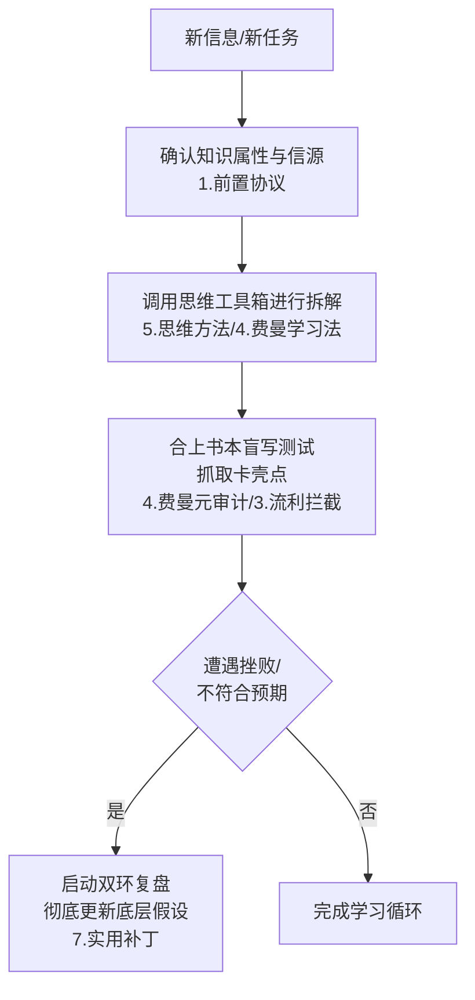

# 思维闭环 - 学习之道

## 📋 系统架构总览

### 核心层级

1. **前置协议层**：数据源与类型审计
2. **顶层定律层**：认知带宽与信息噪音比（SNR）
3. **学习目标层**：智力谦逊与边界划定
4. **学习方法层**：费曼输出的元认知审计
5. **思维方法层**：认识论确证机制
6. **思维误区层**：证实偏差拦截
7. **实用补丁层**：双环学习复盘

---

## 🧭 1. 认识论前置协议（学习前的"数据源与类型审计"）

**元认识论核心**：在注入数据前，先判定知识属性与来源可靠性，严防认知噪音。

### 知识属性标记

- **事实性知识**（数据/死记硬背）
  - 不运行深度推导，直接启动**高频提取（SRS）**代码
- **原理性知识**（模型/底层逻辑）
  - 严禁孤立记忆，必须并入现有网络进行**融贯性测试**
- **程序性知识**（技能/动态操作）
  - 关闭书本，直接在沙盒环境（实际操作）中运行**反馈回路**

### 信源确证度审计

> ❓ 我获取该知识的源头是**一手硬核事实（科学/推导）**，还是**二手的行业流行语/幸存者偏差**？

---

## 🏛️ 2. 顶层定律层：认知带宽与信息噪音比（SNR）

### 基础方法

**熵增定律 → 熵减法则**

### 关键审计点

- **信噪比审计**

  > 我此刻的熵减行动，是在引入**高确证度的结构化知识**，还是在疯狂囤积**让我产生安全感的"认知噪音"**？

- **带宽保护**
  > 我的认知后台是否正被"焦虑、虚假的确定性"占满？是否需要清空缓存？

---

## 🎯 3. 学习目标层：智力谦逊与边界划定

### 基础方法

**认知觉醒、认知驱动**

### 关键审计点

- **流利错觉拦截**

  > 我的觉醒是建立在"真正能推导底层逻辑"的基础上，还是陷入了**"看懂了很多大道理"的语义流利错觉**？

- **认知边界确立**
  > 我能精准画出关于这个领域的**"已知边界"**与**"未知深渊"**吗？（明确知道自己不知道什么）

---

## 🧪 4. 学习方法层：费曼输出的"元认知审计"

### 基础方法

**费曼学习法**

### 关键审计点

- **黑话伪装拦截**

  > 当我用简单的话解释它时，我是在**真正用原子级要素推导**，还是在**用熟练的行业术语（黑话）或漂亮修辞来绕过我其实不懂的盲区**？

- **盲写应激测试**
  > 合上书本，在白纸上纯盲写出该概念的逻辑全貌，哪一个环节我闪烁其词、卡壳了？（卡壳处即为系统 Bug）

---

## 🛠️ 5. 思维方法层：认识论确证机制

### 基础方法

**线性思维** + **互补思维**

- **线性**：闭环、系统、框架、结构化、深度思考、底层逻辑、表象与本质、第一性原理、原子级要素
- **互补**：逆向思维

### 关键审计点

- **第一性原理元审计**

  > 我拆解出来的所谓"原子级要素/底层逻辑"，是**被事实确证的真理**，还是**我自己凭直觉主观臆断的"伪硬核事实"**？

- **系统思考元审计**

  > 我所构建的因果回路闭环，是否漏掉了关键的**外部随机性变量**和**边界条件**？

- **逆向思维元审计**
  > 我是在为了反驳而反驳，还是在寻找支撑对立观点的**高质量、硬核反向证据**？

---

## 🕳️ 6. 思维误区层：证实偏差拦截

### 基础方法

**思维陷阱识别**

### 关键审计点

- **自嗨行为拦截**

  > 我目前在收集的信息，是在**挑战、证伪我的认知模型（Debug 升级）**，还是在**迎合我的原有偏见（买高赞同感）**？

- **概率更新协议**
  > 遇到反向证据时，我是在本能地愤怒防卫，还是将其作为**贝叶斯增量**，动态调低我对原有信念的信心指数？

---

## 🩹 7. 实用补丁层：双环学习复盘

### 基础方法

**复盘机制**

### 复盘层次

- **单环复盘**

  > 事情没做好，我该如何调整技术动作方法？

- **双环复盘（元认知介入）**
  > 事情没做好，**是否意味着我最初评估这件事的"底层假设、价值标准和认识论模型"从一开始就全错了？**

---

## 🚀 系统日常运行流程

---

## 💡 实践建议

1. **建立检查清单**：将各层级的审计问题制作成卡片，学习时逐项核对
2. **定期复盘**：每周回顾一次自己的学习过程，识别认知偏差
3. **刻意练习**：选择重要知识点，完整跑通整个思维闭环流程
4. **持续迭代**：根据实践反馈，不断优化个人的认知审计标准
